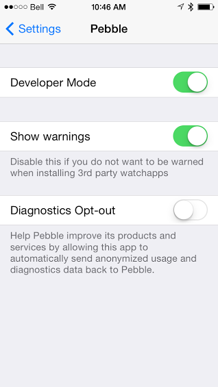

Salesforce1 Pebble Dashboard Sample App
====================

**_Contents_**

[1 - Quick Star](#heading=h.of47jvudgjfd)

[2 - Overview](#heading=h.gj1pp8mvciah)

[3 - Getting Started](#heading=h.2iejpddc13st)

[4 - Setup](#heading=h.dblyn67uwwdt)

[5 - Usage](#heading=h.tv91w78azlqy)

[6 - Next Steps](#heading=h.t5qpsmbd6dnk)

[7 - Conclusion and Personal Notes](#heading=h.mgorhtegy7t0)

[Appendix - Troubleshooting](#heading=h.i7utbjm453pe)

1 - Quick Start
--------
Salesforce1 Pebble Dashboard sample application requires the installation of the GitHub package on your phone and the creation of three Salesforce Reports in your Salesforce Org/Instance. This document will outline the prerequisites and required steps. These instructions and the testing have been done with an iPhone5.

This sample application is part of the[ Salesforce Wear Developer Pack](http://developer.salesforce.com/wear), a collection of open-source starter apps that let you quickly design and build wearable apps that connect to the Salesforce1 Platform.

## Prerequisites

*1. Install the Pebble App on your phone and enable the Pebble Developer Mode.*

* From the "App Store" search for the Pebble Smartwatch app from Pebble Technologies.

* Install the App.

* Enable Developer Mode, in iOS you open the iPhone's Settings and find the Pebble app. Then toggle on "Developer Mode".

* From the Pebble Smartwatch app, go to the menu list and select "DEVELOPER" and toggle it on. It will time-out regularly so you will need to turn it off then on again to reset it.

*2. Sign-up for a CloudPebble account.*

* Go to https://cloudpebble.net/ and sign up for an account.

* It is recommended you try the 'Hello World' guide to make sure everything is working properly.

	[https://developer.getpebble.com/2/guides/](https://developer.getpebble.com/2/guides/)

* You will normally need your smartphone and computer on the same network to download new Pebble applications.

*3. Get a Salesforce Org/Instance available for use.*

* A free Developer Edition Org is available at
	[https://developer.salesforce.com/signup](https://developer.salesforce.com/signup) .

* Note: enter a real email address that but your user name should be something like "your.name@pebble.test". You will get a confirmation after a few minutes to complete the sign up process.

## Installation

*1. Install the Salesforce1 Pebble Dashboard.*

* In the CloudPebble web console select "PROJECTS".

* Choose "IMPORT".

* Select "IMPORT FROM GITHUB".

* Use "Salesforce1" or a similar name that you want to be displayed from the app list on the smartwatch.

* Enter "github.com/developerforce/WearablePack-Pebble" for the GITHUB PROJECT.

* Then click IMPORT and wait for the load to complete.

* Select "COMPILATION" on the left side bar in CloudPebble web console.

* Select "RUN BUILD".

* It is suggested that you toggle the "DEVELOPER" setting in the Pebble smartwatch application off then on again to make sure it hasn't timed out. Make sure it is ON.

* Select "INSTALL AND RUN" to download the Salesforce1 Pebble Dashboard to your Pebble watch. It may take one or two minutes but if it take any longer it likely did not establish a suitable connection; try refreshing the browser page and making sure you are on the same WiFi network.

*2. Log into Salesforce.*

* In the Pebble App on your smartphone, go to the "MY PEBBLE" page that will show all the custom apps you have on the watch.

* Click on the watch icon that is now on the screen with the name you installed. eg. "Salesforce1"

* Click on "SETTINGS".

* Enter your Salesforce credentials (user name and password).

* You may be told that you need to provide a verification code that will be emailed or SMS within a few minutes. You need to provide that 5 digit code here.

* Next you will be prompted to "Allow" the Pebble watch application to use the APIs to connect to Salesforce.

*3. Create the Salesforce Reports.*

* From a web browser, log in to https://login.salesforce.com .

* Click on the "Reports" tab.

* Select a report, for example under the "Administrative Reports" select "All Active Users". Click on the "Customize" button then "Save As" or "Save".

* Make sure the "Report Properties" are updated to have "Report Unique Name" set to Pebble_Watch_Summary_0 and the "Report Description" is a short string describing the report.

*4. Select the App on your Watch.*

* Click on the top row to see the dashboard information.

The following "Getting Started" and “Setup” provide more details on how to install the application. 

# 2 - Overview
--------

This sample application is designed to illustrate how to connect your smartwatch to Salesforce1 using the REST API call and the OAuth standard.  The application will display the totals from three reports configured in Salesforce on the Pebble watch in a dashboard format.

The application shows the various ways a manager can access important information to manage daily activities like SLA attainment for the day, new pipeline created, or the available leads that still need to be converted.  Alternatively, this same sample code could be used by an individual user to track their own targets or information such as deals closed or remaining cases in queue.

The code can easily be used to run any custom query to retrieve any data you want to gather from any object in Salesforce and display multiple lines.  It is also possible to extend the code to create new records directly from the watch.

There are several components involved in the flow of information and authentication in this application.

*A) Pebble Watch App*

This application displays the information on the watch and handles input via the user.  It is written in C using CloudPebble.net and is the primarily user interface for this application.

*B) SmartPhone running the Pebble App (smartphone)*

The Pebble App on your phone is where the JavaScript (JS) code will execute. This JS makes the REST API calls to Salesforce and handles the data that is received from Salesforce. This is also where the OAuth connection to Salesforce is managed. The JS only needs to identify the URL for the OAuth process.  The Pebble App will launch the page in its browser so that the JS code only receives the token. (Your user name and password are passed directly to Salesforce and not entered in the JS.)  The JavaScript also utilizes persistent storage for the OAuth token to ensure that the user does not need to constantly reauthenticate.

*C) Salesforce*

The Salesforce1 Platform enables the connection of all your devices to the data that drives the business process, data collection, and analytics, giving you everything you need to collect and display data related to the Pebble Watch app.  You don’t need any special code on Salesforce for the *Salesforce1 Pebble Dashboard* application to function.  You can sign-up for a free Force.com Developer Edition (DE) account to try this sample code.  Since this interface is written in JS, the REST APIs are the most convenient because they are lightweight.  You simply need to  set the ‘Report Unique Name’ of one of the reports to ‘**Pebble_Watch_Summary_0**’ to indicate the data set you want to show on the watch.

*D) Salesforce App*

You will use the standard Salesforce UI using a web browser to update the reports.  To update the data in Salesforce, you can use the web UI, Salesforce1 Mobile App, or use the APIs to update records from the Pebble.

**Flow**

1) The code is initiated by the Pebble watch when the application is selected.  The Pebble Watch App communicates over Bluetooth Low Energy (BLE) to your smartphone where the Pebble App on the smartphone receives the requests and checks for a valid connection to Salesforce.  If there is no valid connection, the welcome screen continues to display.  When you click a menu row on the watch, a message pops up instructing you to log into Salesforce through your smartphone by clicking on "SETTINGS" for the *Salesforce1 Pebble Dashboard* app.

2) Selecting "SETTINGS" will open the Salesforce login web page, which initiates the OAuth login procedure.  This does not require any code in the JavaScript until the OAuth process completes.  Upon completion of the OAuth sign-in, the Callback URL directs the Salesforce OAuth page to send the response to the Pebble App on the smartphone.  This contains the OAuth token and other basic connect information that will be used for all future REST API calls.

3) Now with the token and connection details stored, the app is able search for the right reports, then use the Salesforce1 Analytics API to pull back data.  In practice, you could make better use of Salesforce data by adding advanced formatting, such as placing multiple elements on a single line or using graphics to display information.  For flexibility and installation simplicity this sample was written without any advanced customizations.

4) Once the data has been received and truncated to fit on the Pebble watch screen, it can be sent to the watch.  It is important to be aware that when you want to send lots of data to the watch, you need to manage a handshake so you don’t lose records.  This is done by setting the variable "load_report" to step through each row and let the Pebble watch pull the next record when it is ready for more data.

The *Salesforce1 Pebble Dashboard* is now displaying the data.  Whenever you navigate away from the app, the data will ‘unload.’  It will refresh all the data whenever you return to the dashboards without the need to login again.  If you want to force a specific report entry to reload, you can select and click on it by using the middle button on the watch.  Timers can be used for regular interval refreshes.

# 3 - Getting Started
--------
## Get a Pebble Watch

Learn more: [https://developer.getpebble.com/](https://developer.getpebble.com/)

## Install the Pebble App from the appropriate App Store

Currently, the *Salesforce1 Pebble Dashboard* code has only been tested with the iPhone5.

1. From the "App Store" search for the Pebble Smartwatch app from Pebble Technologies.

2. Install the App on to your smartphone.

3. Enable Developer Mode, in iOS you open the iPhone's Settings and find the Pebble app. Then toggle on "Developer Mode".

4. From the Pebble Smartwatch app, go to the menu list and select "DEVELOPER" and toggle it on. It will time-out regularly so you will need to turn it off then on again to reset it.

This sample code tries to follow similar layout and conventions as also found in other templates that are available on the CloudPebble website.  You are encouraged to review the template code available at:

[https://cloudpebble.net/](https://cloudpebble.net/)

to become familiar with developing for the Pebble Watch before you do significant modifications to this sample app.  Learning how to hand the Pebble C/JS interaction is critical to displaying Salesforce information on the watch.

## Sign-up for a CloudPebble account

The Cloud Pebble site provides a cloud based development platform to write custom Pebble apps using C and JavaScript.

1. Go to [ https://cloudpebble.net/](https://cloudpebble.net/)  and sign up for an account.

2. It is recommended you try the 'Hello World' guide to make sure that everything is working properly.

    1. [https://developer.getpebble.com/2/guides/](https://developer.getpebble.com/2/guides/)

3. You will normally need your smartphone and computer on the same network to download new Pebble applications.  Additionally, some networks have advanced security that will prevent the peer to peer connection.

4. Make sure you have at least one available slot in the Pebble App on your smartphone to install the *Salesforce1 Pebble Dashboard* app.

## Download the *Salesforce1 Pebble Dashboard* App

The package is available from the GitHub under ‘Salesforce Developers’ and authored by ‘DanHca’

[https://github.com/developerforce/WearablePack-Pebble/](https://github.com/developerforce/WearablePack-Pebble/) .

Note that your softphone should be on the same network as the Pebble watch to be able to push code from your smartphone.

1. In the CloudPebble web console, select "PROJECTS".

2. Choose "IMPORT".

3. Select "IMPORT FROM GITHUB".

4. Use "Salesforce1" or a similar name that you want to be displayed from the app list on the smartwatch.

5. Enter the PROJECT for the GITHUB PROJECT

github.com/developerforce/WearablePack-Pebble/tree/master/samples/SF1PebbleDashboard/Pebble

6. Click "IMPORT" and wait for the load to complete.

7. Select "COMPILATION" on the left side bar in the CloudPebble web console.

8. Select "RUN BUILD".

9. It is suggested that you toggle the "DEVELOPER" setting in the Pebble smartwatch application OFF then ON again to make sure it hasn't timed out. Make sure it is ON.

10. Select "INSTALL AND RUN" to download the *Salesforce1 Pebble Dashboard* to your Pebble watch. It may take one or two minutes but if it takes any longer, it likely did not establish a suitable connection.  If this happens, try refreshing the browser page and making sure you are on the same WiFi network.

The *Salesforce1 Pebble Dashboard* app is now installed.

# 4 - Setup 
--------
When the *Salesforce1 Pebble Dashboard* app starts, it will display the welcome screen indicating it has started.  However, it will not have connected to the Salesforce1 Platform until you use the Pebble App on your smartphone to provide your Salesforce user name and password.

## Getting a Free Salesforce Developer Edition Org

If you do not have a Salesforce Org/Instance then you can sign up for a free Developer Edition (DE) available:

[https://developer.salesforce.com/signup](https://developer.salesforce.com/signup)

Since this is sample code, you should only be using it with a non-production instance of Salesforce to protect from any unintended side-effects.

Note: enter a real email address when signing up for the DE Org so you will get the confirmation emails but your user name should be something like "your.name@pebble.test" or "nickname@coolwatch.app" . You will get a confirmation after a few minutes to complete the sign-up process.

If you are new to Salesforce and want to learn more, check out the extensive developer focused information available at:

[https://developer.salesforce.com/](https://developer.salesforce.com/)

along with the great "Force.com Workbook" to have you building a customized application regardless of your background.  The workbook also has more detail on how to sign up for the free DE Org.

[https://developer.salesforce.com/page/Force.com_workbook](https://developer.salesforce.com/page/Force.com_workbook)

##  Authorizing Pebble to Connect to Salesforce

Salesforce provides the security for all the data and reports so before Pebble can connect to receive the information from Salesforce, you must provide the username and password.

1. In the Pebble App on your smartphone, go to the "MY PEBBLE" page that will show all the custom apps you have on the watch.

2. Click on the watch icon that is now on the screen with the name you installed. eg. "Salesforce1"

3. Click on "SETTINGS".

4. Enter your Salesforce credentials (user name and password).

5. You may be told that you need to provide a verification code that will be emailed or sent via SMS within a few minutes. You need to provide that 5 digit code here.

6. Next you click "Allow" the Pebble watch application to use the APIs to connect to Salesforce.

Note that when you click on **SETTINGS** it will initiate the Pebble code:

**`Pebble.addEventListener("showConfiguration",..**.`

that will invoke the "login.salesforce.com" page with the appropriate OAuth settings.

You can read more about Salesforce OAuth process from this site:

[https://developer.salesforce.com/page/Using_OAuth_to_Authorize_External_Applications](https://developer.salesforce.com/page/Using_OAuth_to_Authorize_External_Applications)

You will not need to change this code to get it to work, since the client ID is a public value that can be used for all Pebble Watch applications.

1. Salesforce will prompt you for your user name and password.

2. Click the "Log in to Salesforce" button on the bottom of the screen.

3. To save time, it is suggested that you check the "Remember User Name".  The password will not be saved, just the user name.

If you are not familiar with OAuth, it is important to understand that the Pebble application does not have access to the user name or password that you are entering.  Only the OAuth token will be passed back to the Pebble App for subsequent connections.

Once you have authenticated with Salesforce, you will then be prompted to confirm that you want the JavaScript application to have access to invoke the API to get data from your Salesforce Org/Instance.

If you click on the SETTINGS button in the Pebble App and you have an existing OAuth session established, you will only be prompted to confirm the *Salesforce1 Pebble Dashboard *is allowed to connected.  This will send a new Access Token to the JS.

OAuth Details

The code that allows the regular OAuth process to work inside the Pebble App is related to the Callback URL.  This must be set to:

		pebblejs://close

since it is the only way to pass information from the web page back to the JS code.

Without this Callback URL, there is no way for your JS code to receive the Access Token for future connections.

Now you can go to the Pebble watch and click on one of the three lines.  You will see the response:

		Unknown
		Report Missing

Indicating you have successfully connected to the Salesforce Org/Instance but there was no report identified for presentation on the Pebble Watch.

## Creating the Report

Any report with a grand total amount at the bottom should work, so you can select an existing report with totals or create one easily using the declarative reporting capabilities.  The Pebble will display the first sum total on the very bottom of the report and a "Report Description".

Here is an example of what the Pebble screen will show:

This is the report defined as:

**Pebble_Watch_Summary_0**

that does a calculation to show the SLA for Cases closed.

This second line displayed is:

**Pebble_Watch_Summary_1**

and shows all the pipeline or opportunities that have been added today based on their project revenue amount.

The last report has not yet been created, which is why the Pebble displays "Unknow".  That is because there is no report with the “Report Unique Name” set to:

**Pebble_Watch_Summary_2** .

You can learn how to create reports in Salesforce by reviewing the following web page:

[https://help.salesforce.com/HTViewHelpDoc?id=reports_builder_editing.htm](https://help.salesforce.com/HTViewHelpDoc?id=reports_builder_editing.htm)

It is important to set the *Report Unique Name *to **Pebble_Watch_Summary_0** (_1 or _2).

The *Report Description* will be used on the Pebble screen as the description so it should be short because the JavaScript will trim the Report Description to 30 characters.

Here is an example of an Opportunity report that uses a formula to sum all the Revenue and display the dollar amount ("Decimal Place" set to 0).

  

# 5 - Usage

You can move through the three report screens using the normal [up] and [down] navigation buttons on the Pebble.  Additionally, to refresh the total on the screen, click the [middle] button.  This can also be done on a timer to automatically refresh every few minutes but will consume more battery and Salesforce API calls.

If you are building your own custom application connected to specific records then you should review the Streaming API which allow you to receive real time notifications when specific data is changed.

[http://www.salesforce.com/us/developer/docs/](http://www.salesforce.com/us/developer/docs/api_streaming/)[API](http://www.google.com/url?q=http%3A%2F%2Fwww.salesforce.com%2Fus%2Fdeveloper%2Fdocs%2Fapi_streaming%2F&sa=D&sntz=1&usg=AFQjCNGSawFmLy-8euvd6KXKD0Yobib2rw)[_streaming/](http://www.salesforce.com/us/developer/docs/api_streaming/)

This will be of particular interest if you were showing the top three Open Cases and want to know the moment one of them was closed so you can refresh your screen.

To illustrate the OAuth process, you can go back to the smartphone Pebble App and select "SETTINGS" which will provide you the OAuth page with the existing user already authenticated, select “Deny” to revoke the authentication token, then go back to the *Salesforce1 Pebble Dashboard* and refresh one of the reports.

# 6 - Next Steps

Within the code, you will see a few lines with examples of how to make the results of queries display in your Pebble App:

	`query?q=SELECT+Name+FROM+User`

The best way to determine what REST call you want to make is by utilizing the Salesforce Workbench

	[https://developer.salesforce.com/page/Workbench](https://developer.salesforce.com/page/Workbench)

and use the SOQL Query and REST Explorer to test your API calls before trying to insert them into the JS.

# 7 - Conclusion and Personal Notes

This was my first Pebble application and I learned a lot about the possibilities that make me want to expand my wearable solutions.  I enjoyed developing on the Pebble watch and think it has a very attractive price point compared with other smartwatches.  As a side note, this is the first watch I have worn in over twenty years, so I wasn’t sure whether I would continue to use it.  However, I have now become dependant on the form-factor because it provides essential information immediately.  I was always putting my phone down and missing key information.  Additionally, it has saved my iPhone’s battery so I can make it through the day without recharging.

I have also created a Pebble App that enables creation of records from the watch.  This is a little more advanced and requires more care as a sample because it makes modifications to your Salesforce Org/Instance.  It doesn’t make sense to do everything for the limited screen size but for repetitive activities from limited data sets - it is ideal. I have been sharing many use cases, such as; 

* creating a quick case or logging the start of a scheduled activity which can initiate a Workflow process in Salesforce,

* how a manager could select one of their employees and see key details as a reminder of what is important to that individual, 

* how a user could see the upcoming appointments or tasks reminding them of what is critical for the day, and my favourite,

* and my favorite - showing all the contact from an account you are about to meet to ensure you can remember everyone’s name and title.  

These are all activities that can be done on a phone but are much less intrusive using wearable technology.

I would suggest as you start to to develop for the Pebble watch, you will want to consider the following ideas.

* Use a stable WiFi network with simple security settings to help reduce download issues from CloudPebble.net to the phone.  My corporate WiFi is locked down and prevents this type of peer-to-peer connection

* Try forcing a refresh of your CloudPebble page if the download fails to connect or try entering the IP address of the phone on the ‘Compilation’ page to ‘install and run’ the app.

* The developer mode on the Pebble App may timeout but the toggle switch will still be enabled, just turn it off and on to reenable it.

* Consider the amount of data you are transmitting to the Pebble and how you are packaging it. You will want to include a handshake to make sure you don’t lose data if you are sending lots of messages back and forth..

* Slow networks can result in long delays for information.  Consider caching information where possible.  I haven’t coded in any special considerations for network delays in the sample code.

Also, utilizing the power of the Salesforce1 Platform will enable much more sophisticated logic by utilizing the capabilities of the Workflow, Triggers, data validation and make sure the information is current.

I hope the code I have provided is useful and helps you establish a wearable technology with real business value.

# Appendix - Troubleshooting

This section outlines some common issues and possible resolutions.

**1. Can’t download the app to the smartwatch**

Try the Cloud Pebble ‘Hello World’ application to ensure you can connect from the smartphone to the watch.  Use the forums and blogs to troubleshoot your connection issues.

http://forums.getpebble.com/categories/developer-discussion 

**2. Connection Failed**

The JavaScript does not have a valid OAuth token.  Try logging in to Salesforce on your smartphone by clicking "SETTINGS" in the *Salesforce1 Pebble Dashboard* in the Pebble App.

**3. Unknown**

The report is not defined.  You need to rename a report to have "Report Unique Name" set to **Pebble_Watch_Summary_0** if is is on the first line, **Pebble_Watch_Summary_1** if it is on the second line, as in the example image, or **Pebble_Watch_Summary_2** if it is on the bottom.

**4. Report Error**

The report does not have a valid description or total.  First check the "Report Description" on the “Report Property” window in the Salesforce Report configuration to make sure a short description is available.  Alternatively, you may have a style of report that does not provide a total amount.  You can add a summary or try a different report.

**5. No update on click**

If you are getting a single vibration on the phone but no updated information or error message, it is possible that your smartphone’s internet connection is not available or very slow.

**6. Pebble screen does not automatically update on OAuth**

It is possible that each row is not finished loading when the Pebble ‘mark dirty’ (the process to refresh the screen) is run so you can load the line item by clicking on the missing row.

